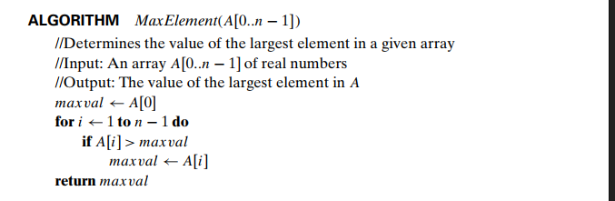

## Algorithm to find Maximum element of an array

**image courtesy:** Solutions to Introduction to The Design and Analysis of Algorithms by Anany Levitin

## Algorithm to check whether all elements in an array are unique

**image courtesy:** Introduction to The Design and Analysis of Algorithms by Anany Levitin

## Matrix Multiplication

**image courtesy:** Introduction to The Design and Analysis of Algorithms by Anany Levitin

## Algorithm to find the number of digits in the Binary representation of a positive number

**image courtesy:** Introduction to The Design and Analysis of Algorithms by Anany Levitin

Please note that Python implementation might show alternate implementations of the same code

### **Extra Python modules used:**
- **Numpy:** Numpy module was used for arrays and its functions

If Numpy module is not installed, make sure pip is installed, go to the terminal and type:

        pip install numpy