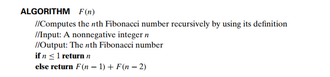

## Algorithm to find Factorial of a number


**image courtesy:** Introduction to The Design and Analysis of Algorithms by Anany Levitin

## Algorithm to find nth term of the Fibonacci sequence



**image courtesy:** Introduction to The Design and Analysis of Algorithms by Anany Levitin

## Tower of Hanoi problem

```
Algo tower(num_disk, source, auxiliary, destination)
    //input: number of disks, source tower, auxiliary tower, and destination tower
    //output: the steps to solve the problem are printed
    if num_disk == 1:
        print: move disk from source to destination
    else:
        tower(num_disk - 1, source, destination, auxiliary)
        print: move disk from source to destination
        tower(num_disk - 1, auxiliary, source, destination)e c
```
[Pesudocode written from memory]