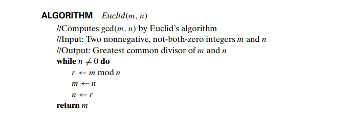

## 1) Euclid's Algorithm to find GCD
- **step 1:** If n = 0, return the value of m as the answer and stop; otherwise,
proceed to Step 2.
- **step 2:** Divide m by n and assign the value of the remainder to r.
- **step 3:** Assign the value of n to m and the value of r to n. Go to Step 1.


**image courtesy:** Introduction to The Design and Analysis of Algorithms by Anany Levitin

## 1) Step Decrementation Algorithm to find GCD

```
    Algo step_decrement(a, b):
        //input: two positive binary integers a, b
        //output: GCD of two numbers
        while a != b:
            if a > b:
                a = a - b
            else:
                b = b - a
        return a
```
[This algorithm has been written by me from memory]