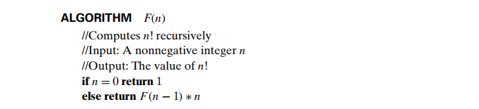

## 1) Algorithm to find Factorial of a number



**image courtesy:** Introduction to The Design and Analysis of Algorithms by Anany Levitin

## 1) Step Decrementation Algorithm to find GCD

```
    Algo step_decrement(a, b):
        //input: two positive binary integers a, b
        //output: GCD of two numbers
        while a != b:
            if a > b:
                a = a - b
            else:
                b = b - a
        return a
```
[This algorithm has been written by me from memory]